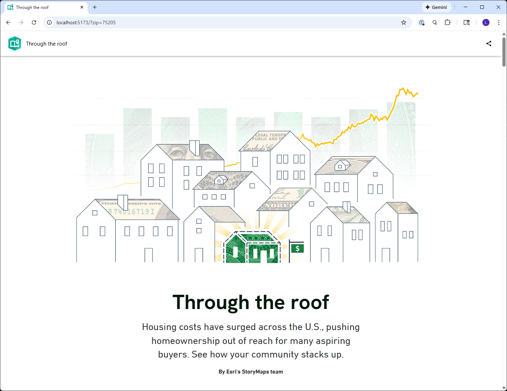

# Through the roof



It's said that money makes the world go round — but for most American households, paychecks aren't stretching as far as they once did.

This enhanced ArcGIS StoryMaps project embeds a story via script and does the following.

* Attempts to determine the user's zip code through geolocation (using a fallback zip, if necessary)
* Fetches zip specific housing affordability data from The Living Atlas
* Intercepts the story's data json and performs substitution on the data in order to present a localized version of the story

## Features

* Uses ArcGIS REST API to fetch housing data
* Creates a proxy fetch handler to intercept story data json

## Instructions

1. **Clone the repository**
   ```bash
   git clone https://github.com/esri/through-the-roof.git
   cd through-the-roof
   ```

2. **Install dependencies**
   ```bash
   npm install
   ```

3. **Start development server**
   ```bash
   npm run dev
   ```

4. **Open in browser**
  `http://localhost:5173`


## Requirements

### Technical Requirements
- **Node.js** (version 18 or higher)
- **npm** package manager
- **Modern web browser** (Chrome, Firefox, Safari, Edge)

### For ArcGIS StoryMaps Integration
- **ArcGIS Online account** or **ArcGIS Enterprise**
- **StoryMaps authoring privileges**

### Optional but Recommended
- **Git** for version control
- **VS Code** or similar code editor

## Resources

* [Introducing Story Embeds via Script!](https://www.esri.com/arcgis-blog/products/arcgis-storymaps/constituent-engagement/introducing-story-embeds-via-script) - ArcGIS Blog post explaining the script embedding technique used in this project

## Issues

Find a bug or want to request a new feature?  Please let us know by submitting an issue.

## Contributing

Esri welcomes contributions from anyone and everyone. Please see our [guidelines for contributing](https://github.com/esri/contributing).

## Licensing

Copyright 2026 Esri

Licensed under the Apache License, Version 2.0 (the "License");
you may not use this file except in compliance with the License.
You may obtain a copy of the License at

   http://www.apache.org/licenses/LICENSE-2.0

Unless required by applicable law or agreed to in writing, software
distributed under the License is distributed on an "AS IS" BASIS,
WITHOUT WARRANTIES OR CONDITIONS OF ANY KIND, either express or implied.
See the License for the specific language governing permissions and
limitations under the License.

A copy of the license is available in the repository's [LICENSE.txt](LICENSE.txt?raw=true) file.
